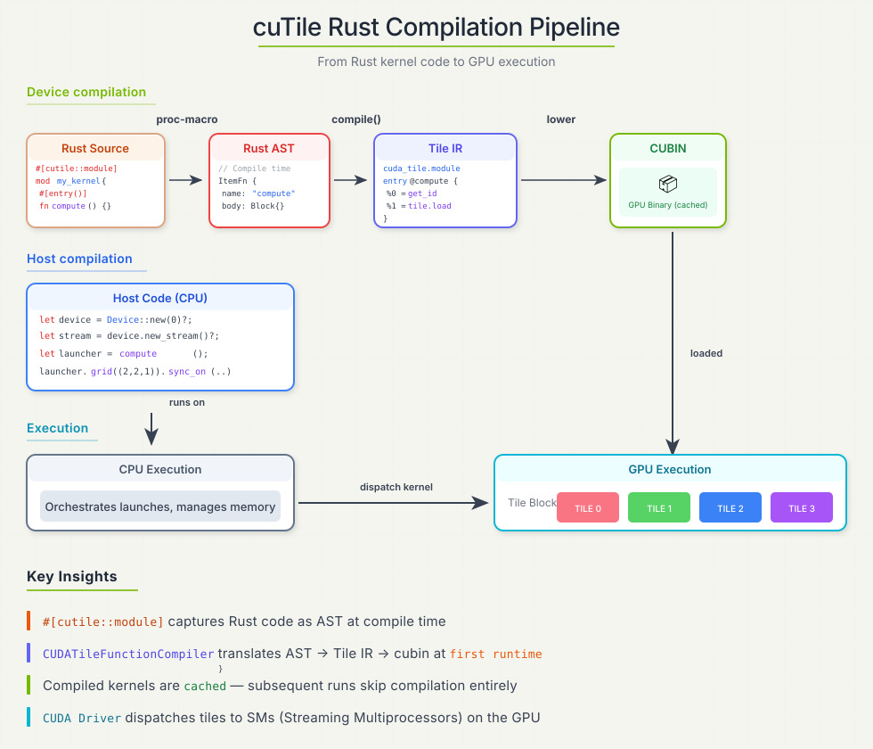

# Compilation

cuTile Rust supports launch-time JIT compilation for normal kernel launches and compile-only APIs for tooling and pre-compilation pipelines. In both paths, the compiler resolves a kernel specialization, lowers it to Tile IR bytecode, and invokes the CUDA Tile IR assembler to produce code for the target GPU. A specialization is the concrete compiled variant for one entry function, target architecture, and set of values that affect generated GPU code.



```text
Rust AST -> Tile IR bytecode -> cubin
```

For launch-time JIT, the compiled kernel is cached in the host process. Launching the same specialization again reuses the cached cubin.

## Launch-Time JIT

For generated `#[cutile::entry]` launchers, compilation happens at first launch, not when the Rust crate itself is built:

```rust
let op = add((&mut z).partition([16, 16]), &x, &y); // Builds a DeviceOp.
let _ = op.sync_on(&stream)?;                       // May compile, then launch.
```

If the cache already contains a matching specialization, launch proceeds without recompilation. Restarting the process clears the in-memory cache.

## What Gets Specialized

The main question is which launch changes create a different specialization.

:::{note}
**Recompilation is scoped to changes that affect a kernel entry function's GPU specialization.**

The closest Rust analogy is monomorphization. In ordinary Rust, a generic function such as `fn f<T, const N: usize>(...)` is compiled separately for each concrete `T` and `N` used by the program. In cuTile Rust, the generated launcher resolves the entry function's concrete type and const generic arguments, places them in the kernel cache key, and passes them to the device compiler. A different entry-function generic set therefore cannot reuse the previous cubin; it produces a distinct GPU specialization.
:::

### Common Recompilation Triggers

Two rules cover the cases users usually see.

**Entry-function arguments.** Type and const generic arguments in the `#[cutile::entry]` signature specialize the generated GPU code. Those values are not always written next to `.generics(...)`; they can also be inferred from host-side values passed to the launcher:

- `z.partition([BM, BN])` can bind the tile shape for `&mut Tensor<T, { [BM, BN] }>`.
- `z.partition([BM, BN]).map([MAP_M, MAP_N], num_tile_blocks)` can bind the output tile shape and the `MAP_SHAPE` for `MappedPartitionMut<T, { [BM, BN] }, MAP_SHAPE>`.
- Passing a tensor to a parameter with static or generic dimensions, such as `&Tensor<T, { [K, -1] }>`, can bind those static dimensions from the tensor shape. Use `-1` for dimensions that should vary without recompilation.

For mapped partitions, `MAP_SHAPE` affects JIT because it is part of the device-side type. `num_tile_blocks` is different: it controls launch-grid inference for how many physical tile blocks traverse the mapped partition. By itself, it does not create a new cache entry.

Runtime tensor data and runtime scalar values can change without recompilation. Dynamic tensor dimensions (`-1`) are passed at runtime; the exact dimension values are not entry-function generics.

**Target architecture.** A cubin is generated for one target GPU architecture. Running the same entry function on a different SM target requires a different compiled artifact.

### Explicit Compile-Time Inputs

The remaining user-controlled recompilation triggers are explicit. Use these APIs only when the compiler should specialize on the value:

- `.const_grid((x, y, z))` embeds the launch grid as a compile-time value. Changing it creates a separate specialization. Use `.grid(...)` when the launch grid should remain runtime-only.
- `.compile_options(opts)` embeds tuning choices such as occupancy, architecture-specific scheduling settings, and divisibility hints. Different options produce separate cache entries.

The key distinction is whether the value participates in the launch cache lookup. `.grid(...)`, runtime scalar values, tensor contents, dynamic dimensions (`-1`), and `MappedPartitionMut`'s `num_tile_blocks` remain runtime launch or data inputs. They do not create new cache entries by themselves.

:::{note}
cuTile may also cache separate optimized variants for tensor specialization hints derived from shape and stride metadata. This is a performance tradeoff: the compiler can generate better code when it knows facts such as power-of-two divisibility for shape dimensions and strides, or that a stride is exactly `1`. Those facts can enable simpler indexing, stronger alignment assumptions, and more efficient memory access. The hints affect cache reuse, but they are not separate values passed to the kernel entry function.
:::

```rust
#[cutile::entry()]
fn add<const S: [i32; 2]>(
    z: &mut Tensor<f32, S>,
    x: &Tensor<f32, { [-1, -1] }>,
) {
    z.store(x.load_like(z));
}
```

Changing `S` from `[16, 16]` to `[32, 32]` creates a new specialization. Changing the runtime shape of `x` from `[1024, 1024]` to `[2048, 1024]` does not change the entry-function generics because both dimensions are dynamic in the kernel signature.

## Designing for Cache Reuse

Treat the entry function signature as the specialization boundary. Put values in type or const generics only when changing those values should produce different GPU code. Keep varying problem sizes as dynamic tensor dimensions when the same compiled kernel should handle them.

Tile shape dimensions are the main exception to the "keep sizes dynamic" rule. Tile IR requires tile shapes to be compile-time constants, and cuTile Rust exposes that through APIs such as `Tile<T, S>` and `tensor.partition(S)`. Dimensions such as `BM`, `BN`, and `BK` are often const generics because changing them changes the tile type the compiler lowers to Tile IR.

Tile shape dimensions and full tensor dimensions play different roles. For mutable outputs, a signature such as `&mut Tensor<f32, { [BM, BN] }>` usually receives a host-side `z.partition([BM, BN])`; the generic shape is the output tile shape exposed to the kernel, not the full output tensor shape. This is expected and does not create a specialization for every problem size. For read-only tensors, generic shape dimensions describe the tensor shape visible to the kernel. Use `-1` for input dimensions that are expected to vary, and use generic/static input dimensions only when those dimensions should be part of the specialization.

```rust
#[cutile::entry()]
fn normalize<const BM: i32, const BN: i32>(
    z: &mut Tensor<f32, { [BM, BN] }>,
    x: &Tensor<f32, { [-1, -1] }>,
) {
    let tile = x.load_like(z);
    let row_max = reduce_max(tile, 1i32);
    z.store(tile - row_max.reshape(const_shape![BM, 1]).broadcast(z.shape()));
}
```

Changing `BM` or `BN` produces a new specialization because they appear in the entry function signature. Changing the full shape of `x` can reuse the same entry-function specialization because both dimensions are `-1` in the signature; shape validation still runs at launch.

Keep the set of tile shapes, element types, target architectures, const grids, and compile options small in hot paths. Excessive specialization increases first-launch latency and memory use.

Tensor and scalar specialization hints are bucketed by power-of-two divisibility. By default, auto-inferred hints are capped at `16`: dimensions such as `16`, `32`, `64`, and `1024` all record the same `divisor = 16`, so changing a dynamic dimension among values divisible by `16` does not create a new cache entry through that dimension's divisibility hint. Changing from a value divisible by `8` to one divisible by `16` can create a different specialization hint and therefore a different cache entry.

`max_divisibility` controls the strongest divisibility assumption the compiler emits from these hints. It is a ceiling, not a request to invent stronger facts. For example, `max_divisibility = 4` makes a value known to be divisible by `16` compile with a `div_by<4>` assumption. Changing `max_divisibility` is itself a compile option change, so it creates a separate cache entry. Values above `16` do not strengthen auto-inferred hints today because inference is already capped at `16`.

## Compile Options and Hints

Entry-level optimization hints are written on the `#[cutile::entry]` attribute:

```rust
#[cutile::entry(
    optimization_hints = (
        sm_120 = (
            num_cta_in_cga = 2,
            occupancy = 2,
            max_divisibility = 16,
            num_worker_warps_per_cta = 4, // Bytecode 13.3+; valid values: 1, 2, 4, 8, 16, 32.
        ),
        sm_90 = (
            num_cta_in_cga = 1,
        ),
    )
)]
fn optimized_kernel<const S: [i32; 2]>(...) { ... }
```

The host can override these values with `CompileOptions`, which is useful for autotuning:

```rust
use cutile::tile_kernel::CompileOptions;

let opts = CompileOptions::default()
    .occupancy(4)
    .num_cta_in_cga(2)
    .num_worker_warps_per_cta(4); // Bytecode 13.3+; valid values: 1, 2, 4, 8, 16, 32.

let _ = optimized_kernel(args)
    .compile_options(opts)
    .sync_on(&stream)?;
```

`num_worker_warps_per_cta` requires bytecode version 13.3 or newer. It must be a power of two in the inclusive range `[1, 32]` (`1`, `2`, `4`, `8`, `16`, or `32`).

Different `CompileOptions` values produce separate JIT cache entries.

Per-operation hints are available on lower-level memory APIs when a specific load or store needs a latency hint or a Tensor Memory Accelerator (TMA) hint:

```rust
let tile = load_view_tko(
    &partition,
    idx,
    ordering::Weak,
    scope::TileBlock,
    Some(4),
    tma::Enabled,
);
```

Use hints to guide the compiler after measuring. The default compiler choices are the right starting point for most kernels.

## Kernel Cache Key

At launch time, cuTile looks for a cached compiled kernel using the active device and the kernel specialization. The pattern below uses the internal field names that define that lookup:

```rust
match TileFunctionKey {
    module_name,
    function_name,
    function_generics,
    stride_args,
    spec_args: [
        (tensor_param, SpecializationBits {
            shape_div,
            stride_div,
            stride_one,
            base_ptr_div,
            elements_disjoint,
        }),
        ...
    ],
    scalar_hints: [
        (integer_or_pointer_param, DivHint { divisor, max }),
        ...
    ],
    grid,
    compile_options,
    source_hash,
    device_id,
    gpu_name,
    compiler_version,
    tileiras_fingerprint,
} {
    cached => reuse_compiled_kernel(),
    missing => compile_and_insert_into_cache(),
}
```

The fields mean:

| Field | What Changes It |
|---|---|
| `module_name`, `function_name` | The `#[cutile::module]` module and `#[cutile::entry]` function being launched. |
| `function_generics` | Type and const generic arguments for the entry function, including tile shapes such as `BM`, `BN`, and `BK` when they are part of the signature. |
| `stride_args` | The stride-one pattern recorded for tensor arguments. |
| `spec_args` | Tensor specialization hints. Today this includes per-dimension shape divisibility, per-dimension stride divisibility, whether each stride is exactly `1`, base-pointer divisibility, and a stride-derived non-overlap bit. |
| `scalar_hints` | `DivHint` values derived from integer scalar parameters and raw pointer parameters. Integer hints are based on value divisibility; pointer hints are based on pointer alignment. |
| `grid` | `Some((x, y, z))` only when `.const_grid(...)` is used. Runtime `.grid(...)` leaves this as `None`. |
| `compile_options` | Per-launch compile options such as occupancy, architecture-specific scheduling settings, and divisibility limits. |
| `source_hash` | A hash of the module's source text, generated by `#[cutile::module]`. Editing any kernel or device function in the module (and rebuilding) changes it, so a stale compiled kernel is never reused across a source change. |
| `device_id` | The active CUDA device. The compiled artifact is loaded per device. |
| `gpu_name` | The target architecture (`sm_90`, `sm_120`, ...), inferred from the device for normal launches. A cubin is generated for one architecture. |
| `compiler_version` | The `cutile-compiler` crate version that produced the entry. |
| `tileiras_fingerprint` | The output of `tileiras --version` for the resolved assembler binary (falling back to its path, size, and mtime). Upgrading the toolkit, or pointing `CUTILE_TILEIRAS_PATH` at a different binary, changes it. |

Values outside this pattern are ordinary launch or data inputs. Tensor contents, floating-point scalar values, and runtime grid values passed with `.grid(...)` do not create cache entries by themselves.

## Persistent Disk Cache

The kernel cache above lives in process memory and dies with the process. cuTile can additionally persist compiled cubins to disk, so a fresh process skips the `tileiras` backend for kernels any earlier process already compiled.

Disk persistence is **off by default, and no environment variable can turn it on**. A program opts in explicitly:

```rust
// ~/.cache/cutile/kernels ($XDG_CACHE_HOME respected), 2 GiB LRU target:
cutile::jit_cache::enable_default()?;

// or a custom location and capacity:
use cutile::jit_cache::FileSystemJitStore;
let store = FileSystemJitStore::builder("/data/kernel-cache")
    .capacity_bytes(512 << 20)
    .open()?;
cutile::jit_cache::enable(std::sync::Arc::new(store));
```

`cutile::jit_cache::disable()` stops all disk reads and writes; kernels already in the in-memory cache are unaffected. The `JitStore` trait behind `enable` is a plain byte-oriented get/put interface, so a custom backend (an object store, a network cache) can replace the filesystem implementation.

A disk hit skips only the `tileiras` subprocess — the compiler frontend still runs on every in-memory miss, because launching needs its parameter-validation output, not just the cubin. The cache key is a SHA-256 over the complete `tileiras` input, field by field: the bytecode version the image was written at (`major.minor` and `tag`; see [Bytecode Version](#bytecode-version)), the serialized Tile IR bytecode itself, the target architecture, the optimization level together with the stage-2 flags byte (`device_debug`, `lineinfo`, `sanitize_memcheck`), and the resolved `tileiras` binary's fingerprint. Because the bytecode inlines every dependency module, changes represented in the serialized compiler input change the key. A changed `tileiras` fingerprint also makes old entries stop matching, although different binaries that report the same version are not distinguished. Stored entries carry a checksummed header that is re-validated field by field on every hit. Torn, corrupted, or request-mismatched entries are treated as misses and recompiled. The checksum provides integrity, not authenticity: anyone who can write the store can construct a valid entry containing arbitrary device code. Custom and shared store locations must therefore be writable only by trusted principals.

Cache I/O can never fail a launch: every read, write, or eviction error is counted and the compile proceeds as if no cache were installed. Observability:

- `cutile::jit_cache::stats()` — hits, misses, entries written, bytes written, soft I/O errors.
- `cutile::jit_cache::jit_backend_compile_count()` / `jit_disk_hit_count()` — with `jit_compile_count()`, these satisfy `compiles == backend + disk_hits` absent failures.
- `CUTILE_JIT_TIMING=1` — the per-kernel timing line includes `stage2_source=disk|tileiras`.

The eviction policy is LRU by file mtime with a high/low watermark pair (defaults: collect above capacity, delete oldest entries down to 80%). The configured capacity is a soft target, not a hard cap: eviction is probabilistically triggered and uses a non-blocking lock, so transient overshoot is possible. Multiple processes can share one cache directory; writes are atomic and eviction is coordinated through a lock file.

Concurrent cold-starting processes do not deduplicate compilation across process boundaries, so they may all run `tileiras` for the same missing key before their atomic writes converge on one entry. To avoid this one-time compilation stampede, warm the shared cache with a single process before launching parallel workers.

See `cutile-examples/examples/jit_disk_cache.rs`; run it twice to watch the second process hit the disk. For implementing a custom backend (an object store, a database), see `cutile-examples/examples/jit_custom_store.rs`.

## Computing Cache Keys

Use a generated launcher to derive the exact keys that a normal launch would use:

| Need | API |
|---|---|
| Only the in-memory L1 key | `launcher.l1_cache_key()?` |
| Only the persistent L2 key | `launcher.l2_cache_key()?` |
| Both keys for one resolved launch specialization | `launcher.specialize()?` |
| An L2 key for a compile-only specialization | `KernelCompiler::l2_cache_key()?` |

### Getting One Key Directly

When only one key is needed, call the corresponding launcher helper:

```rust
let l1_key = my_kernels::copy(
    cutile::api::meta::<f32>(&[1024]).partition([128]),
    cutile::api::meta::<f32>(&[1024]),
)
.generics(vec!["f32".into(), "128".into()])
.l1_cache_key()?;
```

Or derive the L2 key directly:

```rust
let l2_key = my_kernels::copy(
    cutile::api::meta::<f32>(&[1024]).partition([128]),
    cutile::api::meta::<f32>(&[1024]),
)
.generics(vec!["f32".into(), "128".into()])
.l2_cache_key()?;
```

`l1_cache_key()` returns the complete structured `TileFunctionKey`, not the shortened `display_hash()` debug label. `l2_cache_key()` returns the 64-character lowercase SHA-256 used by the persistent cache.

Each terminal consumes its launcher. If both keys are needed, resolve the launch specialization once instead of constructing the launcher twice.

### Getting Both Keys

`specialize()` resolves the specialization identity for this launch without compiling or launching the kernel. It materializes the launch inputs and returns a `Specialization` containing the complete L1 key and a lazy module AST provider:

```rust
let specialization = my_kernels::copy(
    cutile::api::meta::<f32>(&[1024]).partition([128]),
    cutile::api::meta::<f32>(&[1024]),
)
.generics(vec!["f32".into(), "128".into()])
.specialize()?;

let l1_key = specialization.l1_cache_key().clone();
let l2_key = specialization.l2_cache_key()?;
```

`Specialization::l1_cache_key()` only borrows an already resolved key, so it returns `&TileFunctionKey` rather than `Result`. `specialize()` may fail while materializing launch inputs, and `l2_cache_key()` may fail while running the compiler frontend or serializing bytecode, so those calls use `?`.

### Matching the Real L2 Lookup

L2 derivation runs the compiler frontend and serializes Tile IR because the persistent key hashes the frontend output. The helper and the real disk-cache lookup share the same bytecode-to-key function:

```text
launcher.l2_cache_key()
    ↓
Specialization::l2_cache_key()
    ↓
KernelCompiler::l2_cache_key()
    ├── compiler frontend
    ├── Tile IR bytecode serialization
    ▼
current_l2_key_for_bytecode()
    ▼
l2_key(...)

compile_bytecode_cached()
    ▼
current_l2_key_for_bytecode()
    ▼
l2_key(...)
```

The bytecode version comes from the serializer. Launcher helpers resolve the target from the launch device; compile-only callers configure it on `KernelCompiler`. The default optimization level and current `tileiras` fingerprint are resolved internally. This makes the helper return the exact L2 key that the JIT would query.

### Work Performed by the Helpers

Both launcher helpers materialize upstream `DeviceOp` inputs to derive strides and specialization hints. An arbitrary upstream operation may perform device work during that step; cache tooling can use `api::meta` inputs to provide tensor metadata without allocating device storage.

After input materialization:

- L1 derivation does not construct the module AST or run the compiler frontend.
- L2 derivation constructs the AST, runs the frontend, and serializes bytecode.
- Neither helper reads or writes a `JitStore`, runs the target-kernel `tileiras` backend, loads a CUDA module, or populates the L1 cache.

The `_on` variants (`specialize_on`, `l1_cache_key_on`, and `l2_cache_key_on`) select the device from an explicit stream instead of the default device policy. All of these APIs derive keys only; callers remain responsible for `JitStore::contains`, `delete`, cache seeding, and prewarm orchestration.

## Compile-Only API

Most users compile kernels by launching a generated `#[cutile::entry]` launcher. cuTile also exposes `cutile::compile_api::KernelCompiler` for pre-compilation and other compile-only workflows that need Tile IR text or bytecode without launching a kernel.

```rust
use cutile::compile_api::KernelCompiler;

let artifacts = KernelCompiler::new(my_kernels::__module_ast_self, "my_kernels", "tile_math")
    .generics(vec!["32".into()])
    .strides(&[("output", &[1])])
    .target("sm_80")
    .compile()?;

let ir_text = artifacts.ir_text();
let bytecode = artifacts.bytecode()?;
```

For cache tooling that only needs the persistent key, use the same builder with `l2_cache_key()`:

```rust
let l2_key = KernelCompiler::new(my_kernels::__module_ast_self, "my_kernels", "tile_math")
    .generics(vec!["32".into()])
    .strides(&[("output", &[1])])
    .target("sm_80")
    .l2_cache_key()?;
```

This runs the frontend and the canonical bytecode serializer but does not compile a cubin or access the configured `JitStore`. The target comes from `.target(...)`; the bytecode version, default optimization level, and current `tileiras` fingerprint are selected internally. Advanced tools that intentionally model another toolchain can continue to call the lower-level `jit_cache::l2_key(...)` with explicit inputs.

`KernelCompiler` takes the same specialization information that a launcher normally infers from its arguments: entry-function generics, tensor stride and specialization hints, scalar hints, target architecture, optional constant grid, and compile options. Use it for pre-compilation pipelines, tooling, tests, and CPU-only validation of generated IR or bytecode. The `.target("sm_...")` value supplies the target architecture explicitly because there is no active CUDA device in compile-only mode.

Compile-only pre-compilation is separate from the launch-time JIT cache. `KernelCompiler` returns artifacts for the specialization you describe; it does not allocate tensors, launch CUDA work, insert a compiled function into the process-local JIT cache, or produce a host-side result value. A later call through the generated launcher still performs the normal cache lookup and may compile on first launch unless that launch path is taught to consume the precompiled artifacts.

## Inspecting Compiler Output

Two entry attributes are honored for inspection. `print_ir = true` prints the generated entry wrapper, the source kernel, and the compiled Tile IR text during JIT compilation:

```rust
#[cutile::entry(print_ir = true)]
fn debug_kernel<const S: [i32; 2]>(...) { ... }
```

`dump_mlir_dir` writes the compiled Tile IR text to files:

```rust
#[cutile::entry(dump_mlir_dir = "/tmp/cutile-ir")]
fn debug_kernel<const S: [i32; 2]>(...) { ... }
```

There is no attribute for substituting hand-edited IR: the compiler always assembles its own output.

The `CUTILE_DUMP` and `CUTILE_DUMP_FILTER` environment variables print the compiler's output to stderr, once per compiled module:

| Variable | Description |
|---|---|
| `CUTILE_DUMP` | Comma-separated stages: `ir` (the Tile IR module as text), `bytecode` or `bc` (the encoded image, decoded back to text), or `all` for both. These are the only stages emitted today; the pass-level names `ast`, `resolved`, `typed`, and `instantiated` are accepted but produce no output. |
| `CUTILE_DUMP_FILTER` | Comma-separated `module::function` paths or bare function names. The dumps are per module, so a qualified entry selects by its module part (`kernels::fmha_prefill` dumps every kernel compiled from `kernels`); a bare function name matches every module. |

`TILE_IR_DUMP=1` is a legacy alias for `CUTILE_DUMP=ir`.

## Bytecode Version

The compiler can write Tile IR bytecode at versions 13.2 and 13.3, and picks one per toolchain so that a newer default is never handed to an older `tileiras`:

1. `CUTILE_BYTECODE_VERSION`, when set (e.g. `13.2`), overrides everything else.
2. Otherwise the resolved toolkit's `cuda.h` decides: CUDA 13.2 emits 13.2, CUDA 13.3 and newer emit 13.3.
3. Otherwise — `CUTILE_TILEIRAS_PATH` pointing at a bare binary, or `tileiras` found on `PATH` — the compiler probes the binary with a small representative kernel at each version, newest first.

The result is clamped to the emittable range. A toolkit older than CUDA 13.2, or a probe that cannot run (the temporary directory is not writable, the binary cannot be launched or crashes, or it rejects every version), is a compile error naming the cause rather than a silent fallback. The selected version is part of the persistent cache key, and `CompileArtifacts::bytecode()` writes the same negotiated version a launch would use.

## Compilation Failures

Most compile-time errors are ordinary type or shape errors: incompatible tile shapes, unsupported element-type combinations, invalid reduction axes, or missing `#[cutile::entry()]`.

JIT failures usually point to the local CUDA installation or target architecture:

| Symptom | Likely cause | Check |
|---|---|---|
| `invalid GPU architecture` | Toolchain does not support the selected SM | `tileiras --help`, CUDA Toolkit version |
| Failed to load generated kernel | Driver/toolkit mismatch | `nvidia-smi`, `nvcc --version` |
| Segfault inside CUDA or Tile IR libraries | Broken toolkit path or incompatible libraries | `CUDA_TOOLKIT_PATH`, dynamic library search path |
| OOM during first launch | Host memory exhausted during compilation | System memory, specialization count |

Restart the process to force recompilation after changing environment variables or clearing a bad in-memory cache entry.

---

Continue to [Device Operations](device-operations.md).
