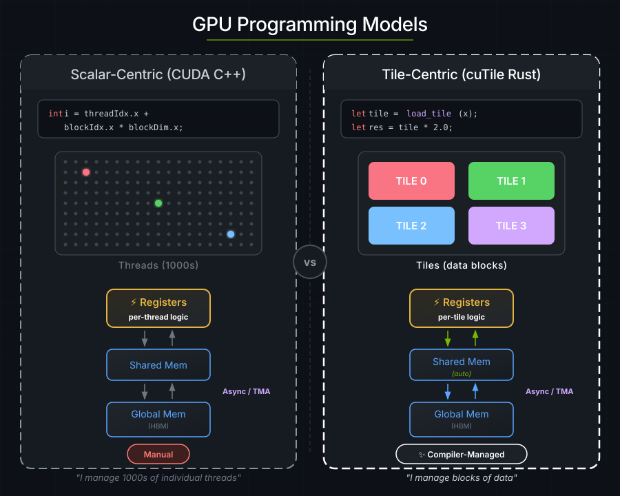
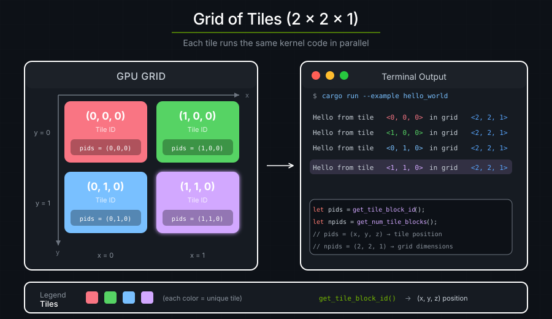

# 1. Hello World

Tile kernels are functions which run as `N` copies concurrently and in parallel when invoked. The primary difference between tile-based kernels and CUDA C++ kernels is the basic unit of execution: a *tile program* (also called a *tile block*), which expresses the computation performed by a single logical thread operating over a multi-dimensional *tile of data*.

> **Note**: The distinction between parallel execution and concurrent execution is intentional: The CUDA runtime executes tile kernels concurrently, many of which may execute in parallel. While some support for inter-tile communication is possible, in-depth knowledge of the CUDA runtime is required to achieve this.



---

Here is a kernel that prints "hello" from the GPU:

```rust
use cutile::error::Error;
use cutile::prelude::*;

#[cutile::module]
mod hello_world_module {
    use cutile::core::*;

    #[cutile::entry()]
    fn hello_world_kernel() {
        let pid0 = program_id(0);
        let pid1 = program_id(1);
        let pid2 = program_id(2);
        let n0 = num_programs(0);
        let n1 = num_programs(1);
        let n2 = num_programs(2);
        cuda_tile_print!(
            "Hello from program <{}, {}, {}> in a grid of <{}, {}, {}> programs!\n",
            pid0, pid1, pid2,
            n0, n1, n2
        );
    }
}

use hello_world_module::hello_world_kernel;

fn main() -> Result<(), Error> {
    let device = Device::new(0)?;
    let stream = device.new_stream()?;
    let launcher = hello_world_kernel();
    launcher.grid((2, 2, 1)).sync_on(&stream)?;
    Ok(())
}
```

**Output:**

```text
Hello from program <0, 0, 0> in a grid of <2, 2, 1> programs!
Hello from program <1, 0, 0> in a grid of <2, 2, 1> programs!
Hello from program <0, 1, 0> in a grid of <2, 2, 1> programs!
Hello from program <1, 1, 0> in a grid of <2, 2, 1> programs!
```

Four tile programs were executed by the CUDA runtime, each printing its own coordinates.

---


## GPU vs. CPU Code

`cutile-rs` programs have two parts: code that runs on the GPU, or the *device-side*, and code that runs on the CPU, or the *host-side*.
The following snippet will JIT-compile to the GPU when executed from the host-side:

```rust
#[cutile::module]
mod hello_world_module {
    use cutile::core::*;

    #[cutile::entry()]
    fn hello_world_kernel() {
        // This code runs on the GPU!
    }
}
```

- `#[cutile::module]` marks a module as containing GPU code.
- `#[cutile::entry()]` marks a function as a kernel entry point.

The kernel function runs **many times concurrently and in parallel** — once for each coordinate in the kernel launch grid.


The following host-side code will launch the device-side code:

```rust
fn main() -> Result<(), Error> {
    let device = Device::new(0)?;             // Connect to GPU
    let stream = device.new_stream()?;             // Create a work queue
    let launcher = hello_world_kernel();   // Get the kernel launcher
    launcher.grid((2, 2, 1)).sync_on(&stream)?; // Launch 2×2×1 = 4 programs
    Ok(())
}
```

Host-side code sets up the GPU, specifies the kernel launch grid, and launches the kernel.

---

## Program IDs

Each tile program is assigned an ID along each axis of the 3-dimensional launch grid, following Triton's `tl.program_id(axis)` / `tl.num_programs(axis)`:

```rust
let pid0 = program_id(0);   // This program's index along grid axis 0
let n0 = num_programs(0);   // The grid extent along axis 0
```

For each axis `k`, `0 <= program_id(k) < num_programs(k)`. The tuple forms `get_tile_block_id()` and `get_num_tile_blocks()` return all three coordinates at once.



Each program runs the same code but with different coordinates. This is how programs divide up work — each one handles a different piece of data based on its ID.

---

## Under the hood

1. **At compile time:** `#[cutile::module]` captures your Rust code as an AST.
2. **At first kernel launch:** The AST is compiled to Tile IR bytecode → cubin (GPU binary).
3. **Cached:** The compiled kernel is cached in memory for the rest of the process, so later launches of the same variant skip compilation. Caching across processes (an on-disk cubin cache) is opt-in; see [Compilation](../guide/jit-compilation.md).
4. **Launch:** 4 tile programs are dispatched to the GPU.
5. **Execution:** All 4 tile programs run concurrently, each printing its coordinates.


---

## Key Takeaways

| Concept | What It Means |
|---------|---------------|
| **Tile programs run concurrently** | You launch N tile programs, they all execute concurrently |
| **Tile programs are assigned IDs** | Each program uses its per-axis IDs to work on different data |
| **Host orchestrates** | CPU code decides grid shape and launches work |
| **Same code, different data** | The kernel is written once and executed by many tile programs |

---

### Exercise 1: Change the Grid Size

Modify the grid to `(3, 3, 1)`. How many messages do you see?

```rust
launcher.grid((3, 3, 1)).sync_on(&stream)?;
```

:::{dropdown} Answer
You should see 9 messages (3 × 3 × 1 = 9 tile programs).
:::

### Exercise 2: Use the Z Dimension

Try `(2, 2, 2)` for a 3D grid. What changes?

:::{dropdown} Answer
You'll see 8 messages. The `z` coordinate will now vary from 0 to 1.
:::

### Exercise 3: Calculate Total Programs

Modify the kernel to also print the total number of tile programs.

:::{dropdown} Answer
```rust
let total = n0 * n1 * n2;
cuda_tile_print!(
    "Program <{}, {}, {}> of {} total programs\n",
    pid0, pid1, pid2, total
);
```
:::
